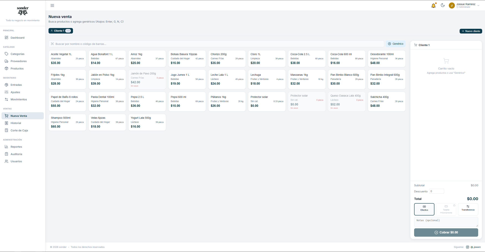
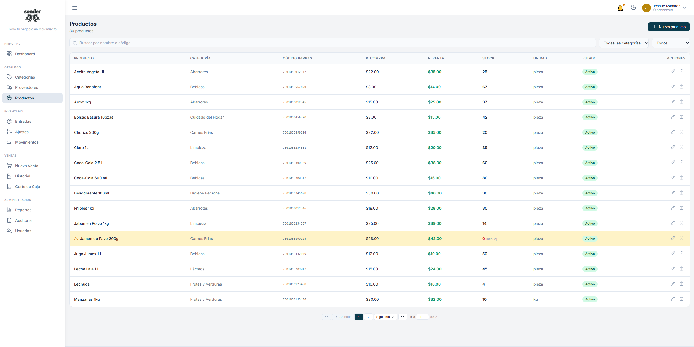
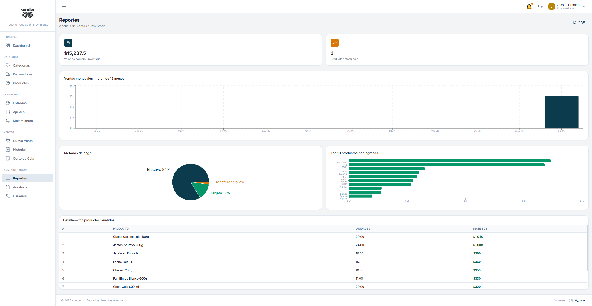

# Sonder

<p align="center">
  
</p>

<h1 align="center">Sonder</h1>

<p align="center">
  <strong>Todo tu negocio en movimiento</strong>
</p>

<p align="center">
  Sistema de gestión comercial moderno para inventario, ventas, reportes y administración de negocios.
</p>

<p align="center">
  
  
  
  
  
</p>

---

## 📖 Acerca del proyecto

Sonder es una plataforma web diseñada para centralizar las operaciones diarias de un negocio.

Permite administrar inventario, procesar ventas, generar reportes, controlar usuarios y monitorear indicadores clave desde una interfaz moderna, rápida y fácil de usar.

El objetivo es reducir procesos manuales y proporcionar información útil para la toma de decisiones.

---

## ✨ Características

### 📊 Dashboard

- KPIs en tiempo real
- Ventas diarias, semanales y mensuales
- Alertas de stock bajo
- Gráficas y estadísticas

### 📦 Inventario

- Productos
- Categorías
- Proveedores
- Ajustes de inventario
- Historial de movimientos

### 🛒 Punto de Venta

- Búsqueda rápida de productos
- Escaneo de códigos de barras
- Carrito de compras
- Descuentos
- Múltiples métodos de pago

### 📈 Reportes

- Ventas por periodo
- Productos más vendidos
- Métodos de pago
- Exportación PDF

### 👥 Usuarios

- Roles y permisos
- Administración de cuentas
- Control de acceso

### 🔍 Auditoría

- Registro de acciones
- Historial de operaciones

### 📱 Integraciones

- WhatsApp (CallMeBot)
- Escaneo mediante cámara
- Modo oscuro

---

## 🖼️ Galería

### Loging


### Punto de Venta



### Inventario



### Reportes



---

## 🎥 Demo

### Vista General


> Puedes grabar un GIF navegando por todo el sistema para mostrar sus funcionalidades principales.

---

## 🏗️ Arquitectura

```text
Frontend (React + TypeScript)
        │
        ▼
   Supabase Auth
        │
        ▼
 PostgreSQL Database
        │
        ├── RPC Functions
        ├── Row Level Security
        └── Storage
```

---

## 🛠️ Tecnologías

| Tecnología      | Descripción          |
| --------------- | -------------------- |
| React           | Biblioteca para UI   |
| TypeScript      | Tipado estático      |
| Vite            | Build Tool           |
| Supabase        | Backend as a Service |
| PostgreSQL      | Base de datos        |
| CSS             | Estilos              |
| Zustand         | Estado global        |
| React Hook Form | Formularios          |
| Zod             | Validaciones         |
| Recharts        | Gráficas             |
| jsPDF           | Exportación PDF      |

---

## 📁 Estructura del proyecto

```text
src/
├── components/
├── pages/
├── store/
├── hooks/
├── lib/
├── assets/
└── index.css
```

---

## 🚀 Instalación

### Clonar repositorio

```bash
git clone https://github.com/AramisHS/sonder.git
cd sonder
```

### Instalar dependencias

```bash
npm install
```

### Configurar variables

```env
VITE_SUPABASE_URL=
VITE_SUPABASE_ANON_KEY=
VITE_CALLMEBOT_API_KEY=
VITE_CALLMEBOT_PHONE_NUMBER=
```

### Ejecutar proyecto

```bash
npm run dev
```

---

## 🔐 Sistema de Roles

| Rol           | Acceso                |
| ------------- | --------------------- |
| Administrador | Acceso completo       |
| Empleado      | Operaciones limitadas |

---

## 📊 Funcionalidades implementadas

- [x] Autenticación
- [x] Gestión de usuarios
- [x] Inventario
- [x] Punto de venta
- [x] Corte de caja
- [x] Reportes
- [x] Exportación PDF
- [x] Auditoría
- [x] Escaneo de códigos
- [x] Notificaciones WhatsApp
- [x] Tema oscuro

---

## 🎯 Roadmap

- [ ] Multi sucursal
- [ ] Control de clientes
- [ ] Compras a proveedores
- [ ] Facturación electrónica
- [ ] Aplicación móvil
- [ ] Dashboard avanzado

---

## 🤝 Contribuciones

Las contribuciones son bienvenidas.

1. Haz un fork
2. Crea una rama
3. Realiza tus cambios
4. Envía un Pull Request

---

## 👨‍💻 Autor

Desarrollado por **Jossué Refugio Ramírez Ávila**

GitHub: https://github.com/AramisHS

---

## 📄 Licencia

MIT License.
